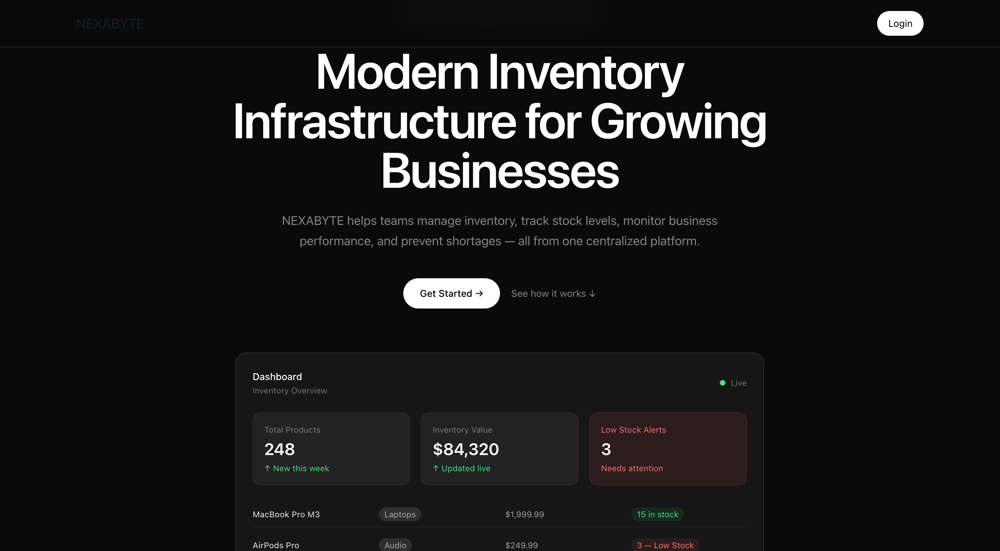
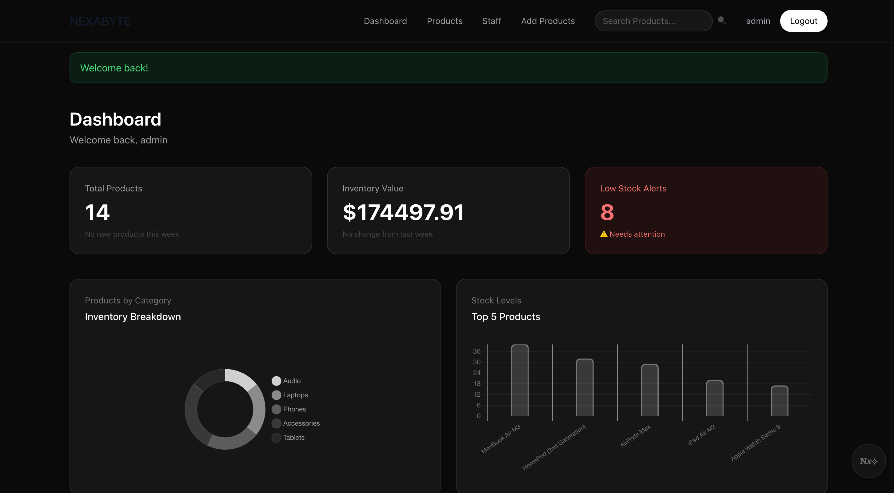
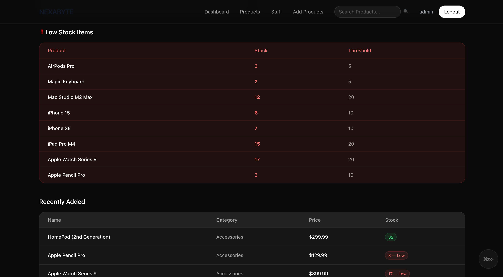
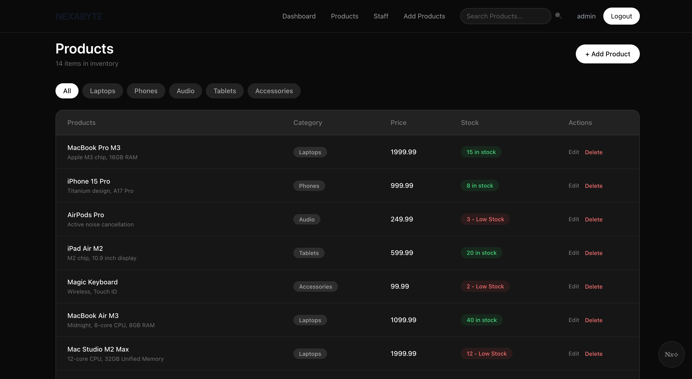
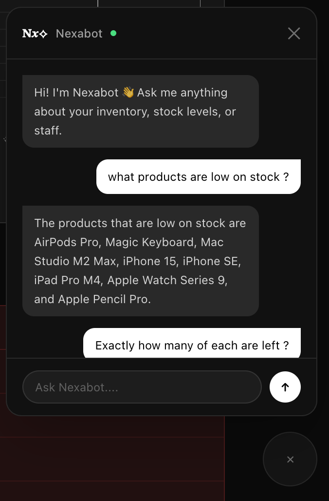
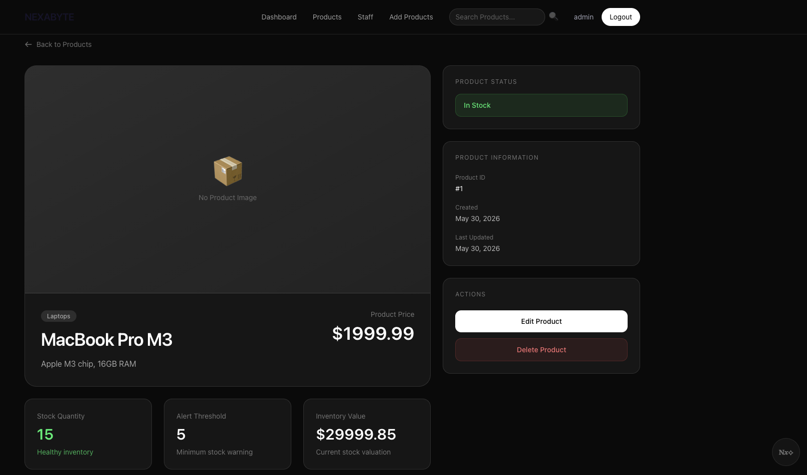

# Nexabyte — Inventory Management System

A full-stack inventory management platform built with Flask, 
PostgreSQL, and OpenAI, featuring role-based access control, 
real-time analytics, and an AI-powered inventory assistant.

[](https://python.org)
[](https://flask.palletsprojects.com)
[](https://railway.app)
[](https://openai.com)

> Demo credentials available on request via GitHub or LinkedIn.
> **Live:** https://nexabyte-inventory-manager.up.railway.app

---

## Screenshots

### Landing Page


### Analytics Dashboard


### Dashboard — Charts & Trends


### Product Management


### Nexabot AI Assistant


### Product Detail View


---

## Engineering Highlights

**App Factory Pattern**  
Uses Flask's `create_app()` pattern to separate application configuration from initialization, improving modularity, testing, and environment-specific deployment.

**Role-Based Authorization via Custom Decorator**  
Authorization is enforced through a custom `@admin_required` decorator, centralizing permission checks and eliminating repetitive role validation across routes.

**AI Context Injection**  
`Nexabot` injects live inventory data and conversation history into every OpenAI request, enabling accurate multi-turn inventory queries based on current database state.

**Database Migrations**  
Flask-Migrate manages schema evolution. A startup validation prevents database seeding before migrations complete, avoiding deployment failures on Railway.

**Analytics Without Redundant Data**  
Inventory metrics and weekly trends are computed directly from transactional data using SQLAlchemy queries, avoiding duplicate analytics tables and unnecessary schema complexity.

**Blueprint Architecture**  
Functionality is organized into dedicated blueprints: `auth`, `products`, `dashboard`, `admin`, `nexabot`, keeping each domain isolated and the application easy to extend.

## Features

**Inventory Operations**
- Add, edit, delete, and search products with full validation
- Filter by category — Electronics, Phones, Audio, Tablets, Accessories
- Per-product low-stock thresholds trigger dashboard alerts
- Stock health indicators and per-product inventory valuation

**Analytics Dashboard**
- Real-time total inventory value across all products
- Weekly trends — products added this week, value change percentage
- Category breakdown via Chart.js doughnut visualization
- Top 5 products by stock level via bar chart

**Role-Based Access Control**
- Admin — full CRUD, staff management, all dashboard features
- Staff — read-only product access, stock visibility
- Route-level enforcement via `@admin_required` decorator
- Admin panel for creating and removing staff accounts

**Nexabot — AI Inventory Assistant**
- Floating chat widget available on every authenticated page
- Powered by OpenAI GPT-3.5-turbo with live inventory context
- Multi-turn conversation with persistent history per session
- Answers questions about stock levels, categories, staff, and value

---

## Tech Stack

- **Backend:** Flask 3, SQLAlchemy, Flask-Migrate
- **Database:** PostgreSQL (Railway)
- **Frontend:** Jinja2, Tailwind CSS, Chart.js
- **Authentication:** Flask-Login with Werkzeug password hashing
- **AI Integration:** OpenAI GPT-3.5 Turbo
- **Deployment:** Railway with Gunicorn

## Local Development

```bash
# Clone
git clone https://github.com/Shone-Davis/nexabyte-inventory-manager
cd nexabyte-inventory-manager

# Environment
python3 -m venv venv
source venv/bin/activate
pip install -r requirements.txt
```

Create `.env` in project root:

```env
SECRET_KEY=your-secret-key
ADMIN_USERNAME=admin
ADMIN_PASSWORD=your-password
DATABASE_URL=sqlite:///nexabyte.db
OPENAI_API_KEY=sk-your-key
```

```bash
flask db upgrade
python app.py
```

Visit `http://127.0.0.1:5000`

---

## API

**`GET /api/products`** — Returns all products as JSON.
No authentication required.

**`POST /nexabot/chat`** — Accepts a natural language message,
returns an AI-generated inventory insight using live database
context. Authentication required.

```json
// Example Request
{ "message": "Which products are low on stock?", "history": [] }

// Example Response
{ "reply": "AirPods Pro (3 units) and Magic Keyboard (2 units) are currently low on stock." }
```

---

## Security

- Passwords hashed with Werkzeug's `scrypt` implementation
- Sessions managed by Flask-Login with encrypted cookies
- Authorization enforced at route level via `@admin_required`
- Zero secrets in codebase — all via environment variables
- `.env` excluded from version control

---

## Roadmap

- [ ] Pytest suite — unit and integration tests
- [ ] CSRF protection via Flask-WTF
- [ ] Rate limiting on login endpoint (Flask-Limiter)
- [ ] Stock transaction history log
- [ ] CSV export for inventory reports
- [ ] Pagination on product listings

---

## Author

**Shone Davis**
GitHub: [@Shone-Davis](https://github.com/Shone-Davis)
Project: [nexabyte-inventory-manager.up.railway.app](https://nexabyte-inventory-manager.up.railway.app)